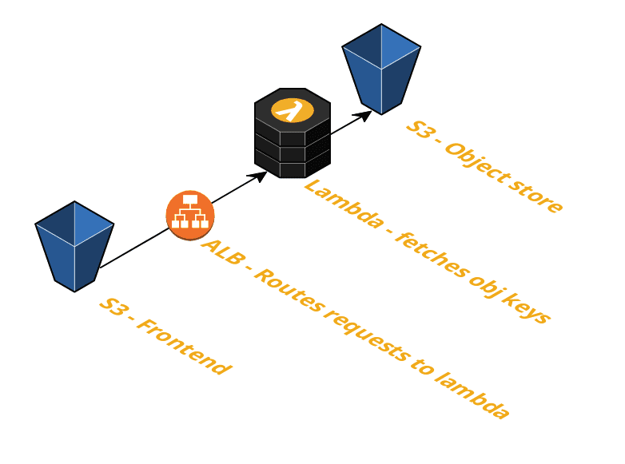
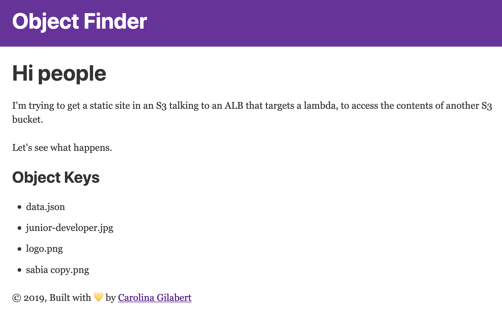
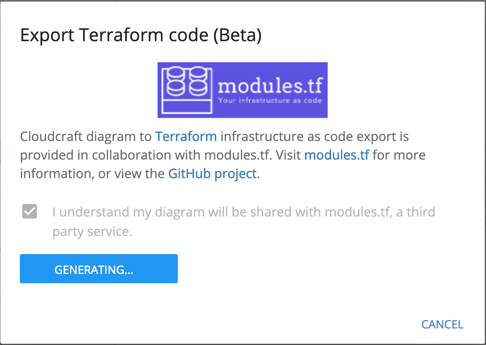

So, recently I set out to try and solve a problem:

S3 in theoretically infinite, so it doesn’t really offer any sort of object search within a bucket.

I needed an easy way of locating specific objects. Indexing the whole bucket is not feasible, or Amazon would do it themselves. But I can provide a narrow time window when my object was created, which should restrict the data to a manageable level.

Considering all the constraints I had, I ended up settling for the following architecture:

🖼 Diagram created on [Cloudcraft](https://cloudcraft.co/)

I created a static site using [GatsbyJS](http://gatsbyjs.org/) that will eventually hold the form to collect the start and end times for our search, and will display the returned objects with some filtering functionality. The site is served from an S3 bucket (labelled S3 frontend).

The site fires requests to an ALB, that is configured to use a lambda target group. The lambda then accesses the bucket and fetches the objects that fit the parameters provided.

This is what the first attempt looks like:

The UI is listing the keys of the objects stored in the bucket. No filtering is in place just yet, as I’m just proving out the connectivity throughout.

I wrote the infrastructure out on Terraform, if you’re interested in the code, you can have a look [here](https://github.com/carolgilabert/object-finder). It’s not neat at all as it’s just a POC, so please reserve judgment 😅

So I kinda got what I was after. Neat! Job done ✅

But…

Around the time I got this working I saw an article on Twitter that I found intriguing 🤔

[modules.tf — Convert visual AWS diagram into Terraform configuration](https://medium.com/devopslinks/modules-tf-convert-visual-aws-diagram-into-terraform-configurations-e61fb0574b10)

So I thought: can I replicate the infrastructure I just created by just creating a pretty picture of it? Will [modules.tf](https://modules.tf/) be able to make a bunch of assumptions to get the connectivity to work?

After all, Cloudcraft doesn’t really allow you to add much detail around your elements, and the ALB does need listeners, VPC and subnet configuration to work.

With all those questions in mind, I went to Cloudcraft and created the diagram I included earlier in this post. Then I very excitedly clicked the Export Terraform code option and…

It broke 💻💥

I got a [502 response](https://http.cat/502) from modules.tf and the page just hung on the export step. Sad times.

---

There’s been a little bit of time between writing and publishing this post, and I decided to give it one last try before hitting publish. To my surprise, it worked! I managed to download some Terraform and Terragrunt files, but it didn’t seem to contain my infrastructure, and I couldn’t really get it to work with the documentation available.  Maybe I’ll try again in a few months.

While I’m not sure Cloudcraft and modules.tf is the answer, it definitely feels like there’s a gap in the market for a tool that allows you to easily deploy infrastructure to try things out. Hopefully something will arise soon 🙂
