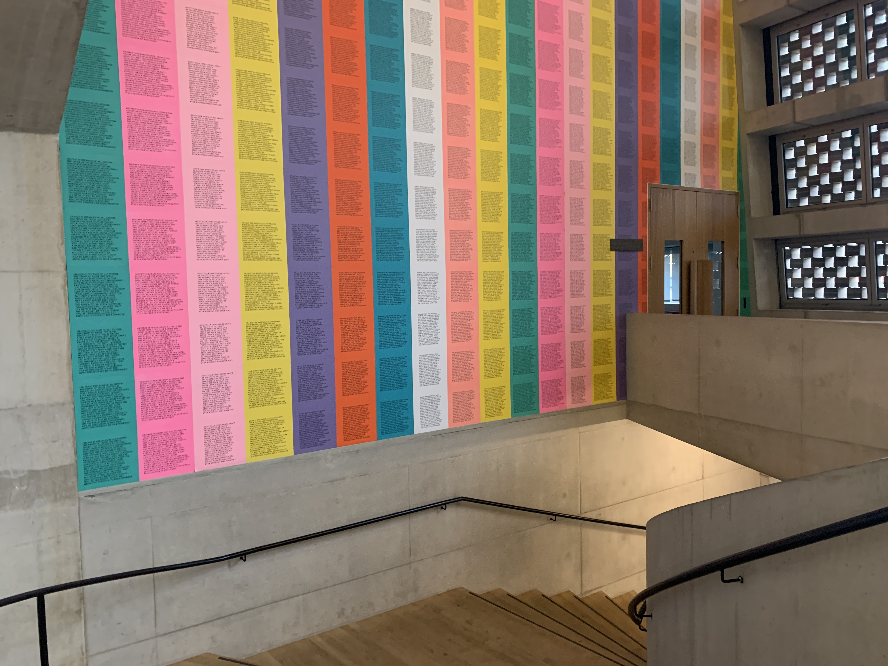

Last week I went to the Tate Modern for the first time. 

<blockquote class="twitter-tweet">
Today i’m visiting the Tate Modern for the first time. I’ve only been here for a few minutes and i’m already /very excited/ 💛 <a href="https://t.co/5zSJnkkc6l">pic.twitter.com/5zSJnkkc6l</a>
&mdash; Carol 🤸‍♀️ (@CarolSaysThings) <a href="https://twitter.com/CarolSaysThings/status/1224317612945002496?ref_src=twsrc%5Etfw">February 3, 2020</a></blockquote>

I always find museums and galleries take me to a reflective state of mind, and I quite enjoy it. My partner and I usually go together, so we end up tangled in deep conversations about our favourite pieces and how they relate to us.

This time I went alone, so I made some notes on my phone, and I think I owe it to them to try and arrange them in a sort of coherent sequence.

At times, when talking about art with friends, they often say they don’t understand art. I feel that’s partly because of the pressure to contextualise art and focus on the history of it. Art is also often seen as a high brow interest. 

Personally, I think classic art is at fault. Historically, society connected with art through their awe over the form, over the immense talent it takes to produce hyperrealistic paintings, or to chisel fabric out of marble.

I can appreciate that skill and join in on the awe, but that’s not all there is to art. Not only that, I think that’s a small part of it.

I love contemporary art. I find it fascinating, because it feels reachable, personable, relatable. The function of art is to reflect human experiences back at us, and contemporary art does this best.

The way I see it, each of us has a personality and a set of experiences. Picture those as the different colours and shapes in a kaleidoscope. 

Contemporary art allows you to look through someone else’s kaleidoscope, and find the shapes and colours that match yours. To me, seeing shared experiences through someone else’s lens is what makes art compelling and great.

Most people in society identify strongly with the groups they belong to. Be those related to your work, hobbies, politics, or whether you prefer tabs or spaces. So it can be easy to forget your individuality, the set of things/ideas/feelings that make you unique.

It’s also easy to group together people you don’t know well, or disagree with, effectively othering them. It’s far easier to dismiss people’s feelings and opinions if they’re not in the same circles as you, as painfully demonstrated by politics worldwide.

Art allows you to revel in your individuality, and connect with people with vastly different experiences. It lets you find the fragments of humanity that you have in common, and isn’t that lovely? 💛

🖼 My favourite piece from this visit: [Inflammatory Essays - Jenny Holzer](https://www.tate.org.uk/art/artworks/holzer-inflammatory-essays-65434)