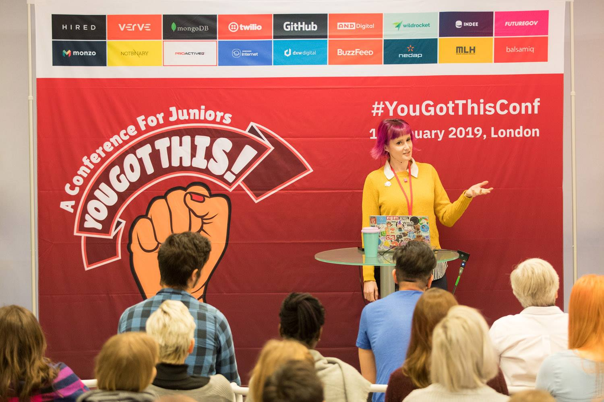
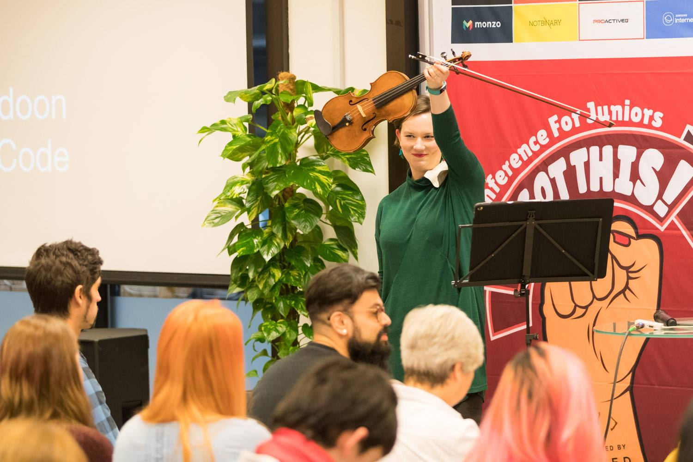
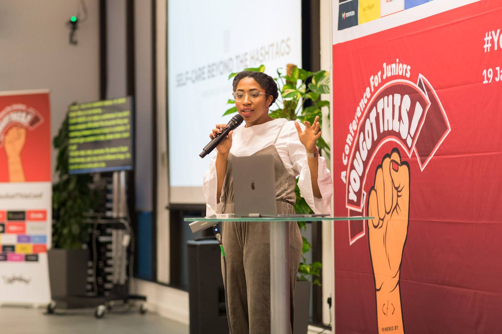
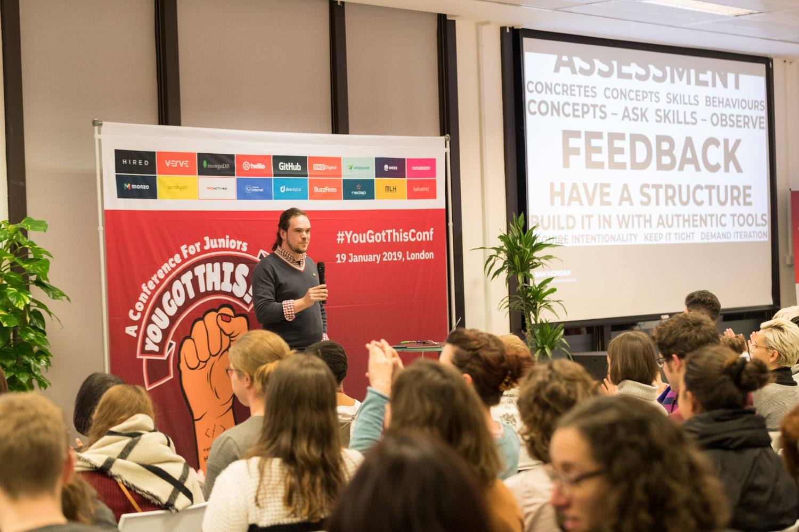

This post has been sitting in my drafts folder for way too long. I’ve been feeling guilty about not finishing it for a while now, but I should be focussing on the fact that I had a brilliant few weeks since this conference, where I did a lot of chilling and non techie things, which I also love 💛

I found out about You Got This! conference on twitter, by accident, only a few weeks before it was held. As soon as I read the premise, I was sold. 

The early stages of any career can be hard, but it feels like getting started in the tech industry can be particularly challenging. The field stretches infinitely in all directions, and it’s very easy to get lost in the amount of things to learn.

This conference did such a good job on focussing on putting folks in the right mindset to thrive, regardless of their role, within this industry.

## Talks
The talks were all very good and I learnt a lot throughout the day. I was quite tired and under slept that day, so unfortunately I didn’t socialise as much as I would have liked. Instead, I focussed on taking it all in.

I’ll try and briefly summarise them:

### Perfectionism, Impostor Syndrome and Anxiety - Understanding your fears and learning to be kind to yourself

They keynote was brilliantly delivered by [Jo Frank](https://twitter.com/ThisIsJoFrank). The topics she covered could not have been better, especially considering the audience. 

She talked about the seemingly ubiquitous issue of impostor syndrome, and the best strategies for dealing with it. She also touched upon perfectionism, and how destructive it can be to our personal and professional lives; after all, perfect is the enemy of good. 

I particularly not-enjoyed realising I have a certain level of anxiety going on. While I’m not consciously stressed about anything in particular, I do struggle to sleep and grind my teeth at night 😬

We all tend to be pretty hard on ourselves, so one of Jo’s quotes really resonated with me:

> Would you talk to a friend like you talk to yourself?

### You know nothing… or do you?

[Sascha Wolf](https://twitter.com/wolf4earth) followed up with a great session on knowledge sharing. It was really empowering, as he encouraged us all to document our journeys through tech, however we liked: blog posts, talks, mentoring, or providing support online.

He stressed the fact that we’re not a walking tech stack, and that we shouldn’t be code ninjas, or rockstar devs, we should be wholesome 💛

### Where did all my money go?

Next up we had [Paula Muldoon](https://twitter.com/FiddlersCode), who started by serenading us with the violin. It was absolutely breathtaking!

Her talk was on money management, and should be required viewing for folks entering the industry. She gave lots of great advice like understanding your relationship with money, budgeting, and looking out for free money 🤑

### Junior.next()

[Tara Ojo](https://twitter.com/tara_ojo) gave us lots of great tools to stretch ourselves into the next level. Self-promotion is hard, especially at the beginning of our careers, when we feel we learnt about 1% of what’s out there.

She went over her strategies for keeping track of her accomplishments. For instance, she has a trello board that she uses to track her personal and professional goals. It’s an excellent idea, as it’s good solace for when we’re feeling a bit down, but it’s also great ammunition for the time performance reviews come around.

I thoroughly recommend giving her talk a watch, it was full of gems 💎 

### Self-care: Beyond the hashtags

[Taylor Morrison](https://twitter.com/taylorelysemo) told us a bit about self care, and why it’s important. She covered the rituals that worked for her, and encouraged folks to find what works for them. Hers was this brilliant quote:

> Self care is listening to your body and responding in the most loving way possible.

### Morality and Ethics - Caring is Everything

[Sam Warner](https://twitter.com/sjwarner_)’s session was focussed on ethical tech. He defined it as causing no negative social impact, and striving to cause social good.

He told us 79.6% of developers believe they have an obligation consider the ethics of their code. Those are good numbers, but personally I don’t feel we’re all as encumbered by this as we perhaps should be.

To that end, Sam shared good resources on learning more about this, chiefly among those the [Ethical OS Toolkit](https://ethicalos.org). He also discussed ethical debt, the importance of accessibility and diversity in teams, and how caring is everything 💛

### Understanding and Cultivating Independence

Violet Peña talked about independence. More specifically, how to get support from you peers without relying on them for your every move. It was a really good perspective, as it put the onus on the person seeking help, which in turn makes the support more concise and helpful.

It means that the person learning has more agency over their tasks, and can get help that enables them, rather than asking for someone else to just do the work on their behalf.

She also gave really good pointers on how to ask for help:

1. Give context
2. Ask a specific question
3. Show your progress
4. Say thanks!

### The transformative power of junior developers

The closing keynote was given by [Sam Morgan](https://twitter.com/sjmog1). He gave a really inspiring talk on the power of junior developers. He remarked on the value brought to the table by fresh perspectives and the questioning mindset of folks early in their career. He also gave a lot of really valuable advice ranging from requesting feedback, how to best approach self learning and assess yourself.

I’m not going to attempt to summarise it, as I wouldn’t do it justice, definitely give it a watch yourself 🙂

## Wrap up
I really enjoyed the fact that this conference had an MC. [Scary Boots](https://twitter.com/schrodingerskit) was really funny, and they did a fantastic job of keeping the audience engaged throughout the day. They also had the best lab coat dyeing tips 🙂

There was a lot of care put into making the event accessible and inclusive. All of the talks were transcribed, which led to this hilarious exchange:

The [highlights page](https://2019.yougotthis.io/highlights) for the event has the video recording, transcript and sketch note for each talk. I’d highly recommend checking that out.

I absolutely loved it, and I’m looking forward to next year’s edition 🙂

📸 Photographs by [Paul Clarke](https://twitter.com/paul_clarke), with a CC-BY-SA license.
